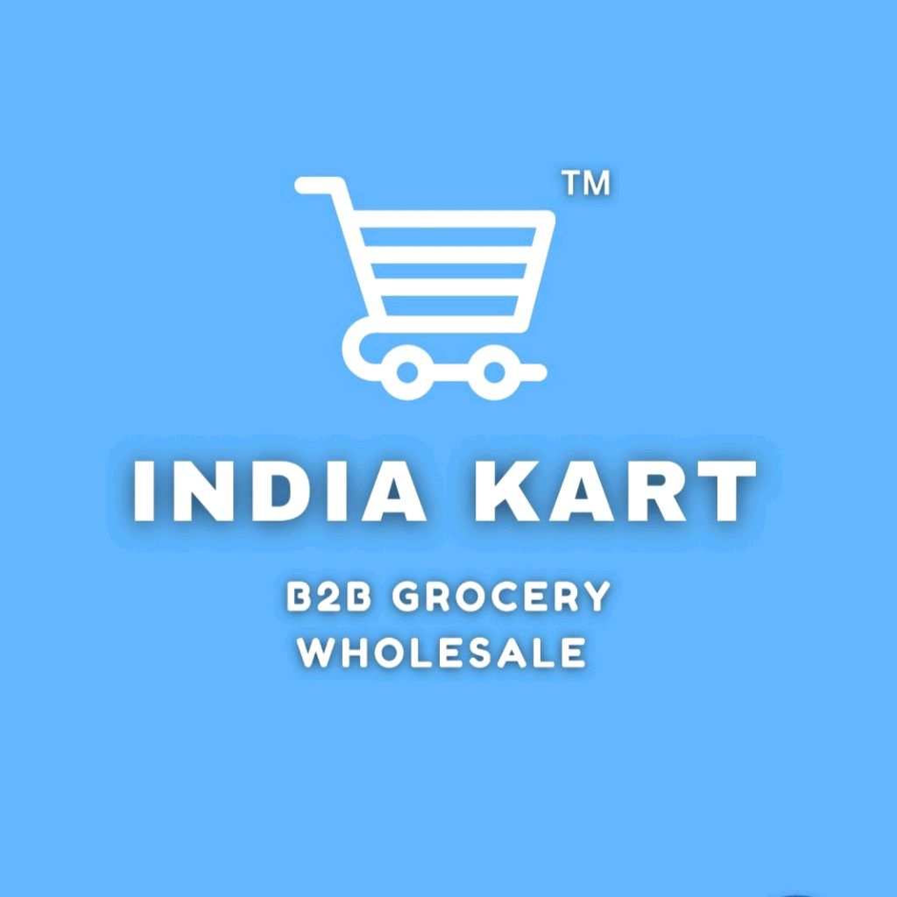

# IndiaKart-E-Commerce-Analytics-Project

## Business Context

IndiaKart is a fast-growing Indian e-commerce marketplace serving customers across India. The platform operates across **10 product categories**, including Electronics, Fashion, Home & Kitchen, Books, Beauty & Health, Sports & Fitness, Toys & Baby, Grocery, Automotive, and Office Supplies.

The business supports multiple payment methods such as **UPI, Credit Card, Cash on Delivery (COD), and EMI**, while working with **7 logistics partners** for order fulfilment and delivery.

As the volume of customers, orders, products, payments, returns, and inventory grows, management requires reliable data-driven insights to understand overall business performance, identify operational issues, and support better strategic decision-making.

This project analyzes approximately **24 months of business operations from June 2023 to June 2025**, covering more than **216,000 records across 8 interconnected datasets**.

     

## Business Problem Statement

IndiaKart generates large volumes of transactional and operational data across orders, customers, products, payments, returns, inventory, and suppliers. However, raw data alone does not provide management with a clear understanding of business performance.

The management team needs an analytical solution that can answer key business questions such as:

- Which product categories generate the highest revenue, and which are underperforming?
- What percentage of orders are being cancelled, and how much business is being lost?
- Which customer segments contribute the most value to the business?
- Are there seasonal patterns in orders and revenue that can support inventory planning?
- Which states and cities represent the strongest markets?
- Which products or categories contribute disproportionately to returns?
- Are payment failures creating revenue leakage?
- Is sufficient inventory available to support customer demand?

The project addresses these challenges by transforming raw operational data into structured KPIs, exploratory insights, and an interactive business intelligence dashboard.

## Project Objectives

The primary objective of this project is to develop an **end-to-end e-commerce analytics solution** that converts IndiaKart's operational data into meaningful and actionable business insights.

Key objectives include:

- Clean and validate the datasets to ensure data quality and analytical reliability.
- Identify missing values, duplicates, invalid data types, outliers, and referential integrity issues.
- Analyze monthly order volume and revenue trends.
- Evaluate revenue contribution across product categories.
- Analyze order cancellations, returns, and payment failures.
- Understand customer segments, purchasing behaviour, and geographic distribution.
- Measure business performance using relevant e-commerce KPIs.
- Identify seasonal patterns that can support inventory and business planning.
- Analyze inventory availability and identify potential stock-related risks.
- Develop an interactive Power BI dashboard for management-level performance monitoring.
- Translate analytical findings into clear business insights, risks, opportunities, and actionable recommendations.

## KPI's & Metrics

The following KPIs and business metrics are used to evaluate IndiaKart's overall performance:

| KPI / Metric | Calculation / Definition | Business Purpose |
|---|---|---|
| **Gross Merchandise Value (GMV)** | Sum of `final_amount` across all orders | Measures total value of business transacted through the platform |
| **Net Revenue** | Sum of `final_amount` where order status = Delivered | Measures revenue generated from successfully delivered orders |
| **Average Order Value (AOV)** | Net Revenue / Number of Delivered Orders | Measures average customer spending per completed order |
| **Cancellation Rate** | (Cancelled Orders / Total Orders) × 100 | Measures the proportion of orders lost through cancellations |
| **Return Rate** | (Return Records / Delivered Orders) × 100 | Evaluates product, fulfilment, and customer satisfaction issues |
| **Customer Lifetime Value (CLV)** | Average `total_spent` per customer segment | Measures the long-term value contributed by different customer segments |
| **Month-over-Month Growth** | ((Current Month GMV - Previous Month GMV) / Previous Month GMV) × 100 | Tracks the direction and rate of business growth |
| **Top Category Revenue Share** | (Category Revenue / Total Revenue) × 100 | Measures revenue concentration across product categories |
| **Payment Failure Rate** | (Failed Payments / Total Payments) × 100 | Identifies potential revenue leakage caused by failed transactions |
| **Inventory Fill Rate** | (In-Stock SKUs / Total SKUs) × 100 | Measures product availability and inventory readiness |

### Additional Analytical Metrics

In addition to the core KPIs, the analysis examines:

- Monthly Order Volume
- Monthly Revenue Trend
- Year-over-Year Revenue Comparison
- Revenue by Product Category
- Order Status Distribution
- Top States by Order Volume
- Customer Segment Distribution
- Payment Method Usage
- Customer Age Distribution
- Return Reasons
- AOV by Customer Segment
- Top Products by Revenue
- New Customers per Month
- Stock Status Distribution
- Low-Stock Products
- Customer Cohort Behaviour

## Stakeholders

The analysis is designed to support multiple business stakeholders across IndiaKart.

| Stakeholder | Key Information Required |
|---|---|
| **CEO / Senior Management** | Overall business performance, revenue growth, risks, opportunities, and strategic recommendations |
| **Sales & Revenue Team** | GMV, net revenue, AOV, category performance, and geographic sales trends |
| **Marketing Team** | Customer segments, geographic markets, customer acquisition trends, and purchasing behaviour |
| **Product / Category Managers** | Category revenue, product performance, return rates, and underperforming products |
| **Operations Team** | Order status, cancellations, fulfilment performance, and operational bottlenecks |
| **Inventory / Supply Chain Team** | Stock availability, low-stock products, warehouse distribution, and inventory fill rate |
| **Finance Team** | Revenue, payment methods, failed payments, refunds, and revenue leakage |
| **Customer Experience Team** | Returns, return reasons, cancellations, and customer-related service issues |

## Data

The project uses **8 interconnected CSV datasets** representing approximately **216,200 records** of IndiaKart's business operations from **June 2023 to June 2025**.

| Dataset | Approx. Records | Description |
|---|---:|---|
| `orders.csv` | 50,000 | Order-level transactions placed on the platform |
| `order_items.csv` | 100,000 | Individual products associated with each order |
| `customers.csv` | 10,000 | Customer profiles, segments, locations, and lifetime statistics |
| `products.csv` | 1,000 | Product catalogue containing pricing and GST information |
| `payments.csv` | 50,000 | Payment transactions, methods, and gateway information |
| `returns.csv` | 10,000 | Product return requests, return reasons, and refund status |
| `inventory.csv` | 1,000 | Warehouse stock levels and reorder information |
| `suppliers.csv` | 200 | Supplier information and performance ratings |

### Data Relationships

The datasets are interconnected through key business identifiers:

- `customer_id` connects **customers** with **orders**.
- `order_id` connects **orders** with **order items, payments, and returns**.
- `product_id` connects **order items** with **products and inventory**.
- Supplier-related identifiers connect **products and inventory operations** with supplier information.

## Technology Stack

The IndiaKart E-Commerce Analytics project follows an end-to-end data analytics workflow, combining data preparation, database management, exploratory analysis, KPI calculation, and business intelligence reporting.

| Technology / Tool | Purpose |
|---|---|
| **Python** | Data cleaning, transformation, exploratory data analysis, and KPI calculations |
| **Pandas** | Data manipulation, preprocessing, aggregation, and analysis |
| **NumPy** | Numerical operations and analytical calculations |
| **Matplotlib** | Data visualization during exploratory data analysis |
| **Seaborn** | Statistical and exploratory visualizations |
| **SQL Server** | Storage and management of cleaned relational datasets |
| **SQL** | Data validation, joins, aggregations, and solving analytical business questions |
| **Power BI** | Interactive dashboard development, KPI monitoring, and business reporting |
| **Jupyter Notebook** | Development and documentation of Python-based analysis |
| **Excel / CSV** | Source data format and preliminary data inspection |

## Project Workflow

The project follows a structured end-to-end analytics workflow, transforming raw e-commerce data into actionable business insights.

### 1. Data Loading

- Loaded all **8 raw CSV datasets** into Python using Pandas.
- Examined dataset structure, dimensions, columns, and data types.
- Performed initial data profiling to understand the quality and characteristics of the data.

### 2. Data Cleaning & Preparation

- Identified and handled missing values.
- Checked and removed duplicate records where appropriate.
- Corrected inconsistent data types and formats.
- Converted date columns into appropriate datetime formats.
- Validated numerical and categorical fields.
- Checked for invalid and inconsistent records.
- Verified relationships and referential integrity between datasets.
- Prepared analysis-ready datasets for downstream processing.

### 3. SQL Server Data Storage

- Designed and created relational tables in **SQL Server**.
- Loaded the cleaned datasets into the database.
- Established relationships between customers, orders, products, payments, returns, inventory, and suppliers.
- Validated record counts and data integrity after loading.
- Created a centralized relational database for analytical querying.

### 4. SQL Business Analysis

- Used SQL to solve analytical and business questions.
- Applied joins to combine information distributed across multiple tables.
- Used filtering, grouping, aggregation, subqueries, and other SQL techniques.
- Analyzed areas such as:
  - Revenue performance
  - Product and category performance
  - Customer segments
  - Order status and cancellations
  - Payment behaviour
  - Returns
  - Geographic performance
  - Inventory availability

### 5. Exploratory Data Analysis (EDA) Using Python

- Performed exploratory data analysis using **Pandas, Matplotlib, and Seaborn**.
- Investigated trends, distributions, patterns, and relationships within the data.
- Analyzed monthly order and revenue trends.
- Compared category and product performance.
- Examined customer segments and geographic markets.
- Analyzed payment methods, return reasons, order statuses, and customer behaviour.
- Created visualizations to communicate important patterns and observations.

### 6. KPI & Metrics Calculation Using Python

Calculated key e-commerce business metrics using Python, including:

- Gross Merchandise Value (GMV)
- Net Revenue
- Average Order Value (AOV)
- Cancellation Rate
- Return Rate
- Customer Lifetime Value (CLV)
- Month-over-Month Growth
- Top Category Revenue Share
- Payment Failure Rate
- Inventory Fill Rate

These KPIs provide measurable indicators of IndiaKart's revenue, customer, operational, payment, and inventory performance.

### 7. Power BI Dashboard Development

- Connected the prepared analytical data to **Power BI**.
- Developed an interactive management dashboard.
- Created KPI cards, charts, trends, comparisons, and business performance views.
- Added filters and slicers to support interactive analysis.
- Organized the dashboard around major business areas such as:
  - Revenue Overview
  - Category Performance
  - Customer Insights
  - Operations
  - Inventory Analysis

### 8. Business Insights & Final Report

- Consolidated findings from SQL analysis, Python EDA, KPI calculations, and Power BI dashboards.
- Identified major business trends, risks, and growth opportunities.
- Converted technical analysis into clear business language for non-technical stakeholders.
- Developed a final management report containing:
  - Executive Summary
  - Key Findings
  - Business Risks
  - Growth Opportunities
  - Actionable Business Recommendations
